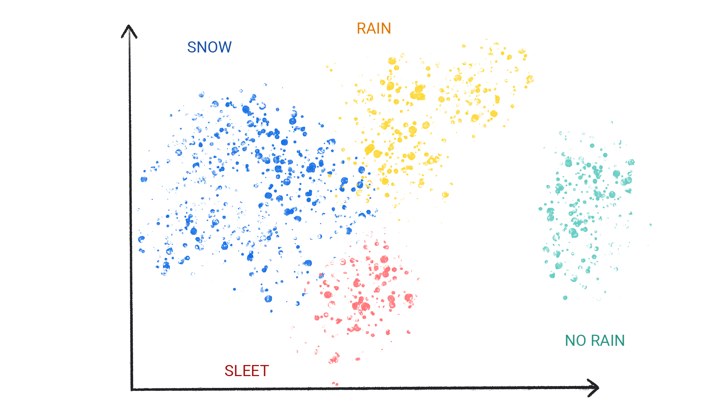
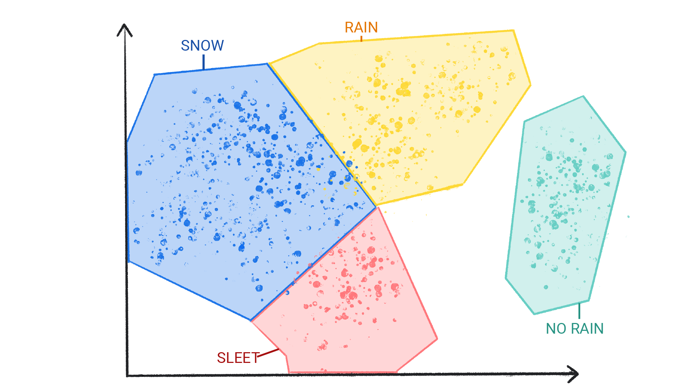

# 机器学习笔记仓库

## 什么是机器学习（Machine Learning, ML）

机器学习（Machine Learning, ML）提供了一种解决问题、回答复杂提问和创造内容的新方法。机器学习可以预测天气、估计旅行时间、推荐歌曲、自动创建句子、总结文章以及生成前所未有的图像。

从根本上来说，机器学习是训练模型（又称软件）以做出有用的预测或者从数据生成内容的过程。

例如，假设我们想创建一个应用程序来预测降雨量。我们可以使用传统方法或机器学习。使用传统方法，我们创建地球大气层和表面的基于物理的表示，计算大量的流体动力学方程。这是非常困难的。使用机器学习，我们将为机器学习模型提供大量天气数据，直到机器学习模型最终*了解*产生不同降雨量的天气模式之间的数学关系。然后我们会给模型提供当前的天气数据，它会预测降雨量。

根据机器学习系统如何学习进行预测或生成内容，可以分为以下一个或多个类别：

- 监督学习
- 无监督学习
- 强化学习
- 生成式人工智能

## 监督学习简介（Supervised learning）

**监督学习**是指模型可以在看到大量具有正确答案的数据之后做出预测，然后发现数据中产生正确答案的元素之间的联系。就像学生通过学习包含问题和答案的旧考试试卷来学习新的材料，一旦这个学生接受了足够多的旧考试试卷的联系，就可以为参加新的考试做好充分准备，俗称“刷题”。这种机器学习系统受到“监督”，即人类向机器学习系统提供已知正确答案的数据。

监督学习最常见的两个用例模型是**回归**的**分类**。

### 回归模型（Regression）

**回归模型**用来预测数值，例如预测降雨量（多少毫米或者多少英寸）的天气模型就是回归模型，下面还有一些回归模型的示例：

| 目的         | 可能的输入数据                                               | 数值预测         |
| ------------ | ------------------------------------------------------------ | ---------------- |
| 未来房价     | 实际使用面积、地段、房型、公摊面积、抵押贷款利率、财务税率、建造成本以及该地区待售房屋数量等。 | 房子的价格       |
| 未来乘车区间 | 历史交通情况、距离目的地的距离、车辆类型以及天气情况等       | 到达目的地的时间 |

### 分类模型（Classification）

**分类模型**用来预测某个事物属于某个类别的可能性。与输出数值的回归模型不同，分类模型输出一个值，表示某物是否属于特定类别。例如预测电子邮件是否是垃圾右键或者照片中是否包含猫。

分类模型还被分为二元分类模型和多元分类模型。二元分类模型从仅包含两个值的类中选择输出其中的一个值，比如输出“下雨”或“不下雨”的模型。多元分类模型从包含两个以上值得类中选择其中的一个值，比如输出“下雨”或“下雪”或“冰雹”或“雾霾”的模型。

## 无监督学习简介（Unsupervised learning）

**无监督学习**是指模型根据给定不包含任何正确答案的数据来进行预测。无监督学习模型的目标是识别数据中具有意义的模式。换句话说，不会给模型提示如何对每条数据进行分类，而是必须推断出自己的一套规则。

无监督学习最常见的用例模型是**聚类**。

### 聚类模型（Cluster）

**聚类模型**可以找到划分自然分组的数据点，具体图例如下：

聚类模型和分类模型不同，因为聚类的类别并不是由人类定义的。例如聚类模型可能会根据温度对天气数据集进行聚类，从而揭示定义季节的分段，然后人类可以尝试根据对数据集的理解来命名这些集群，具体图例如下：

## 强化学习（Reinforcement learning）

**强化学习**是指模型根据环境中执行的操作获得奖励或惩罚来进行预测。强化学习系统最终会定义一个获得最多奖励的最佳策略。

强化学习目前常用于训练机器人执行任务，例如在房间中能够进行走动的运动机器人，亦或者类似AlphaGo这样的软件机器人。

## 生成式人工智能（Generative AI）

生成式人工智能是一类根据用户输入进行内容输出的模型。例如生成式人工智能可以创造独特的图像、音乐作品和笑话，亦或者它可以总结文章、解释如何执行任务甚至编辑照片。

生成式人工智能可以接收各种输入并创建各种输出，例如文本、图片、音频和视频。它还可以多模态化，比如模型可以将图像作为输入并输出图像和文本，亦或者将图像和文本同时作为输入并输出音视频。

以下是生成式人工智能模型的一些输入和输出的部分列表：

-  文本到文本
-  文本转图像
-  文字转视频
-  文本到代码
-  文字转语音
-  图像转文本

下表列出了生成模型的部分示例，即输入和其可能的输出示例：

| 模型       | 输入                                                         | 可能输出                                                     |
| ---------- | ------------------------------------------------------------ | ------------------------------------------------------------ |
| 文本到文本 | 勒芒大赛是谁发明的？                                         | 勒芒 24 小时耐力赛由西部汽车俱乐部创办 (ACO)，一个成立于1906年的汽车组织。举办了第一场比赛 1923 年 5 月 26 日至 27 日在萨尔特赛道 (Sarthe Circuit) 举行，这是一条全长 13.426 公里的赛道 （8.345 英里）公路赛道位于法国勒芒镇附近。 这场比赛最初的目的是为了推广 ACO 和 萨尔特地区。 |
| 文本转图像 | 一只外星章鱼漂浮在门框中阅读报纸。                           |          |
| 文字转视频 | 一只逼真的泰迪熊正在旧金山的海洋中游泳。泰迪熊潜入水下。泰迪熊和色彩缤纷的鱼儿一起在水下不停地游动。一只熊猫正在水下游泳。 |  |
| 文本到代码 | 编写一个 Python 循环，循环遍历数字列表并打印素数。           | for number in numbers:      # Check if the number is prime.     is_prime = True     for i in range(2, number):         if number % i == 0:              is_prime = False             break     # If the number is prime, print it.     if is_prime:         print(number) |
| 图像转文本 |                | 这是一只火烈鸟。它们被发现于加勒比海。                       |

生成式人工智能的工作原理是什么呢？概括来讲就是模型学习数据模式以生成新的但相似的数据，示例如下：

- 通过观察人们的行为和说话风格来学习模仿他人的喜剧演员
- 通过研究大量特定风格的绘画来学习特定风格绘画的艺术家

为了生成独特且具有创意的内容，生成式人工智能模型最初使用无监督学习方式进行训练，模型学习或模仿其训练数据。有时也会使用监督学习或者强化学习方式针对模型所遇到的某些任务相关的特定数据进行进一步训练，比如文章总结或者图片编辑。
